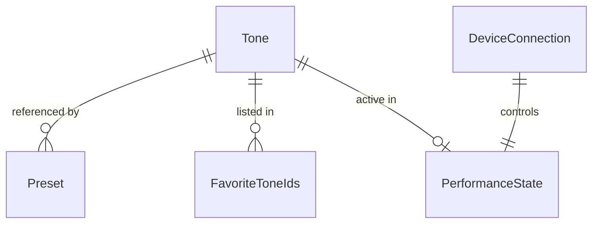

# Data Model: FP-30X Custom Controller

**Branch**: `001-fp30x-custom-controller` | **Date**: 2026-03-31

## Entities

### Tone

Represents a selectable sound on the FP-30X. Static data hardcoded from the MIDI Implementation document.

| Field | Type | Description | Constraints |
|-------|------|-------------|-------------|
| id | string | Unique identifier | Format: `{msb}-{lsb}-{pc}` (e.g., `87-66-0`) |
| name | string | Display name | Non-empty, from MIDI Implementation doc |
| category | enum | Tone category | `piano` · `epiano_keys_organ` · `other` · `drums` · `gm2` |
| gmFamily | string? | GM2 family name | Only for `gm2` category (e.g., "Piano", "Strings") |
| bankMSB | number | Bank Select MSB (CC 0) | 0–127 |
| bankLSB | number | Bank Select LSB (CC 32) | 0–127 |
| programChange | number | Program Change number | 0–127 |

**Counts**: 12 Piano + 20 E.Piano/Keys/Organ + 24 Other + 9 Drums + 256 GM2 = **321 total**

**Identity/Uniqueness**: `id` (composite of MSB + LSB + PC) is unique across all tones. Two tones cannot share the same MSB/LSB/PC combination.

**State**: Immutable. Data is hardcoded in a static JSON file within the app bundle. No lifecycle transitions.

---

### Preset

A user-created snapshot of MIDI state that can be re-applied to the piano with one tap.

| Field | Type | Description | Constraints |
|-------|------|-------------|-------------|
| id | string (UUID) | Unique identifier | Auto-generated |
| name | string | User-provided name | Non-empty, max 50 chars |
| createdAt | timestamp | Creation date | ISO 8601 |
| updatedAt | timestamp | Last modification date | ISO 8601 |
| isDefault | boolean | Whether this is the auto-apply preset | Only one preset can have `isDefault = true` |
| sortOrder | number | Position in the presets list | 0-indexed |
| toneId | string | Reference to the Tone | Valid tone ID |
| volume | number? | CC 7 value (Phase 2+) | 0–127, null in Phase 1 |
| expression | number? | CC 11 value (Phase 2+) | 0–127, null in Phase 1 |
| pan | number? | CC 10 value (Phase 2+) | 0–127 (64 = center), null in Phase 1 |
| reverbSend | number? | CC 91 value (Phase 2+) | 0–127, null in Phase 1 |
| chorusSend | number? | CC 93 value (Phase 2+) | 0–127, null in Phase 1 |

**Identity/Uniqueness**: `id` (UUID) is unique. `name` is not enforced as unique but UI should warn on duplicates.

**State transitions**:
```
Created → Active (applied to piano) → Modified → Deleted
```

**Persistence**: Stored in MMKV as JSON. Survives app restarts.

**Invariant**: At most one preset can have `isDefault = true`. Setting a new default must clear the previous one.

---

### DeviceConnection

Represents a BLE MIDI connection session to an FP-30X.

| Field | Type | Description | Constraints |
|-------|------|-------------|-------------|
| deviceId | string | BLE peripheral identifier | Platform-assigned |
| deviceName | string | BLE advertised name | From BLE scan |
| status | enum | Connection state | `idle` · `scanning` · `discovered` · `connecting` · `connected` · `disconnected` |
| lastConnectedAt | timestamp? | Last successful connection | ISO 8601, null if never connected |
| isFirstConnectionThisSession | boolean | Tracks whether default preset has been applied | Reset to `true` on app launch, set to `false` after first successful connection + preset apply |

**State transitions**:
```
idle → scanning → discovered → connecting → connected ⇄ disconnected
                                                         ↑
                                                    (auto-reconnect)
```

**Persistence**: `deviceId`, `deviceName`, `lastConnectedAt` persisted in MMKV for auto-reconnect. `status` and `isFirstConnectionThisSession` are runtime-only.

---

### PerformanceState

The app's internal mirror of what has been sent to the piano. Runtime-only (not persisted).

| Field | Type | Description | Constraints |
|-------|------|-------------|-------------|
| activeToneId | string? | Currently selected tone | Valid tone ID or null |
| activePresetId | string? | Currently applied preset | Valid preset ID or null |
| pendingToneId | string? | Tone queued before connection | Valid tone ID or null, cleared after sending |
| volume | number | Current volume level (Phase 2+) | 0–127, default 100 |
| expression | number | Current expression (Phase 2+) | 0–127, default 127 |
| pan | number | Current pan position (Phase 2+) | 0–127, default 64 |
| reverbSend | number | Current reverb send (Phase 2+) | 0–127, default 40 |
| chorusSend | number | Current chorus send (Phase 2+) | 0–127, default 0 |

**State**: Runtime store only. Rebuilt from user actions. Not persisted across sessions (the piano itself resets on power-off, so no value in persisting this).

---

### FavoriteToneIds

Simple collection of tone IDs the user has marked as favorites.

| Field | Type | Description | Constraints |
|-------|------|-------------|-------------|
| ids | string[] | Array of tone IDs | Each must reference a valid Tone |

**Persistence**: Stored in MMKV as a JSON array. Survives app restarts.

---

### AppSettings

Minimal app-level settings.

| Field | Type | Description | Constraints |
|-------|------|-------------|-------------|
| lastUsedCategory | enum | Last viewed tone category | `piano` · `epiano_keys_organ` · `other` · `drums` |
| themePreference | enum | User's theme override | `system` · `light` · `dark` (default: `system`) |

**Note**: The default preset is determined by `Preset.isDefault` (at most one can be `true`). There is no separate `defaultPresetId` here to avoid dual source of truth.

**Persistence**: Stored in MMKV. Survives app restarts.

## Relationships



## Data Volume Assumptions

- **Tones**: 321 static records (< 50KB JSON) — loaded once at startup
- **Presets**: User-created, expected 1–20 per user (< 5KB total)
- **Favorites**: Expected 5–30 tone IDs (< 1KB)
- **Total local storage**: < 100KB expected, well within MMKV capabilities
